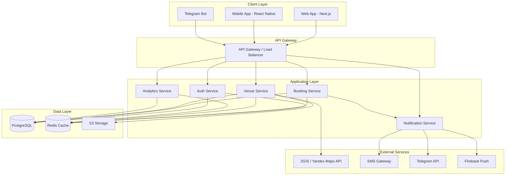

# Документ проектирования системы онлайн-записи Qlink

## Обзор

Система онлайн-записи Qlink представляет собой современное веб- и мобильное приложение, построенное на принципах минимализма, скорости и простоты использования. Архитектура системы разработана для обеспечения загрузки интерфейса менее чем за 2 секунды и завершения процесса записи максимум за 3 шага.

### Ключевые принципы дизайна

- **Минимализм**: Чистый интерфейс без визуального шума
- **Скорость**: Оптимизация производительности на всех уровнях
- **Простота**: Интуитивные действия без обучения
- **Mobile-first**: Приоритет мобильного опыта
- **Масштабируемость**: Готовность к росту нагрузки

### Цветовая палитра

- **Основной цвет**: #2563EB (синий) - основные действия, акценты
- **Акцентный цвет**: #06B6D4 (бирюзовый) - вторичные действия, выделения
- **Фон**: #F9FAFB (светло-серый) - фон приложения
- **Текст**: #111827 (темно-серый) - основной текст
- **Белый**: #FFFFFF - карточки, модальные окна

## Архитектура

### Общая архитектура системы



### Технологический стек

**Frontend:**
- Web: Next.js 14+ (React 18+, TypeScript)
- Mobile: React Native (TypeScript)
- State Management: Zustand / Redux Toolkit
- UI Components: Tailwind CSS, Headless UI
- Maps: React-Leaflet для 2GIS/Yandex Maps
- Forms: React Hook Form + Zod validation

**Backend:**
- Runtime: Node.js 20+ LTS
- Framework: Express.js / Fastify
- Language: TypeScript
- API: REST + GraphQL (Apollo Server)
- Authentication: JWT + OAuth2
- Validation: Zod / Joi

**Database:**
- Primary: PostgreSQL 15+ (с расширениями PostGIS для геоданных)
- Cache: Redis 7+ (кэширование, сессии, очереди)
- ORM: Prisma / TypeORM

**Infrastructure:**
- Hosting: Yandex Cloud / AWS
- CDN: Cloudflare
- File Storage: S3-compatible storage
- Message Queue: Redis Bull / RabbitMQ
- Monitoring: Prometheus + Grafana
- Logging: Winston + ELK Stack

**External Integrations:**
- Maps: 2GIS API, Yandex Maps API
- Notifications: Telegram Bot API, Firebase Cloud Messaging
- SMS: Twilio / SMSC.ru
- Payments: ЮKassa / Stripe (для будущих фич)

## Компоненты и интерфейсы

### 1. Authentication Service (AuthService)

**Ответственность:**
- Регистрация и аутентификация пользователей
- Управление сессиями и токенами
- Поддержка OAuth2 (Telegram, Google)
- Валидация прав доступа

**API Endpoints:**
```typescript
POST   /api/auth/register          // Регистрация нового пользователя
POST   /api/auth/login             // Вход по телефону/email
POST   /api/auth/telegram          // Вход через Telegram
POST   /api/auth/refresh           // Обновление токена
POST   /api/auth/logout            // Выход
GET    /api/auth/me                // Получение текущего пользователя
```

**Интерфейсы:**
```typescript
interface User {
  id: string;
  phone?: string;
  email?: string;
  telegramId?: string;
  firstName?: string;
  lastName?: string;
  role: 'client' | 'venue_owner' | 'admin';
  createdAt: Date;
  updatedAt: Date;
}

interface AuthTokens {
  accessToken: string;
  refreshToken: string;
  expiresIn: number;
}
```

### 2. Venue Service (VenueService)

**Ответственность:**
- Управление заведениями
- Управление мастерами и услугами
- Расчет доступных временных слотов
- Геопоиск заведений

**API Endpoints:**
```typescript
// Venues
POST   /api/venues                 // Создание заведения
GET    /api/venues                 // Поиск заведений (с фильтрами)
GET    /api/venues/:id             // Получение заведения
PATCH  /api/venues/:id             // Обновление заведения
DELETE /api/venues/:id             // Удаление заведения
GET    /api/venues/nearby          // Поиск заведений поблизости

// Masters
POST   /api/venues/:id/masters     // Добавление мастера
GET    /api/venues/:id/masters     // Список мастеров
PATCH  /api/masters/:id            // Обновление мастера
DELETE /api/masters/:id            // Удаление мастера

// Services
POST   /api/venues/:id/services    // Добавление услуги
GET    /api/venues/:id/services    // Список услуг
PATCH  /api/services/:id           // Обновление услуги
DELETE /api/services/:id           // Удаление услуги

// Schedules
POST   /api/masters/:id/schedule   // Настройка расписания
GET    /api/masters/:id/schedule   // Получение расписания
GET    /api/masters/:id/slots      // Доступные слоты
```

**Интерфейсы:**
```typescript
interface Venue {
  id: string;
  ownerId: string;
  name: string;
  description?: string;
  address: string;
  location: {
    lat: number;
    lng: number;
  };
  phone: string;
  email?: string;
  category: VenueCategory;
  rating: number;
  reviewCount: number;
  photos: string[];
  workingHours: WorkingHours;
  isActive: boolean;
  createdAt: Date;
  updatedAt: Date;
}

interface Master {
  id: string;
  venueId: string;
  name: string;
  description?: string;
  photo?: string;
  rating: number;
  reviewCount: number;
  services: string[]; // service IDs
  schedule: MasterSchedule;
  isActive: boolean;
}

interface Service {
  id: string;
  venueId: string;
  name: string;
  description?: string;
  price: number;
  duration: number; // в минутах
  masterIds: string[];
  isActive: boolean;
}

interface MasterSchedule {
  masterId: string;
  workingDays: {
    [key: string]: { // 'monday', 'tuesday', etc.
      isWorking: boolean;
      startTime: string; // '09:00'
      endTime: string;   // '18:00'
      breaks: TimeRange[];
    };
  };
  exceptions: ScheduleException[]; // выходные, отпуска
}

interface TimeSlot {
  startTime: Date;
  endTime: Date;
  isAvailable: boolean;
  masterId: string;
  serviceId: string;
}
```

### 3. Booking Service (BookingService)

**Ответственность:**
- Создание и управление записями
- Валидация доступности слотов
- Управление статусами записей
- Предотвращение двойного бронирования

**API Endpoints:**
```typescript
POST   /api/bookings               // Создание записи
GET    /api/bookings               // Список записей (с фильтрами)
GET    /api/bookings/:id           // Получение записи
PATCH  /api/bookings/:id           // Обновление записи
DELETE /api/bookings/:id           // Отмена записи
POST   /api/bookings/:id/confirm   // Подтверждение записи
POST   /api/bookings/:id/complete  // Завершение записи
POST   /api/bookings/:id/no-show   // Отметка неявки
GET    /api/bookings/my            // Мои записи (для клиента)
GET    /api/venues/:id/bookings    // Записи заведения
```

**Интерфейсы:**
```typescript
interface Booking {
  id: string;
  clientId: string;
  venueId: string;
  masterId: string;
  serviceId: string;
  startTime: Date;
  endTime: Date;
  status: BookingStatus;
  clientPhone: string;
  clientName?: string;
  notes?: string;
  createdAt: Date;
  updatedAt: Date;
}

enum BookingStatus {
  PENDING = 'pending',           // Ожидает подтверждения
  CONFIRMED = 'confirmed',       // Подтверждена
  COMPLETED = 'completed',       // Завершена
  CANCELLED = 'cancelled',       // Отменена
  NO_SHOW = 'no_show'           // Неявка
}

interface BookingRequest {
  venueId: string;
  masterId: string;
  serviceId: string;
  startTime: Date;
  clientPhone: string;
  clientName?: string;
  notes?: string;
}
```

### 4. Notification Service (NotificationService)

**Ответственность:**
- Отправка уведомлений через разные каналы
- Управление шаблонами уведомлений
- Планирование напоминаний
- Отслеживание доставки

**API Endpoints:**
```typescript
POST   /api/notifications/send     // Отправка уведомления
GET    /api/notifications          // История уведомлений
POST   /api/notifications/schedule // Планирование уведомления
GET    /api/notifications/preferences // Настройки уведомлений
PATCH  /api/notifications/preferences // Обновление настроек
```

**Интерфейсы:**
```typescript
interface Notification {
  id: string;
  userId: string;
  type: NotificationType;
  channel: NotificationChannel;
  title: string;
  message: string;
  data?: Record<string, any>;
  status: 'pending' | 'sent' | 'failed';
  scheduledAt?: Date;
  sentAt?: Date;
  createdAt: Date;
}

enum NotificationType {
  BOOKING_CREATED = 'booking_created',
  BOOKING_CONFIRMED = 'booking_confirmed',
  BOOKING_CANCELLED = 'booking_cancelled',
  REMINDER_24H = 'reminder_24h',
  REMINDER_2H = 'reminder_2h',
  NEW_BOOKING_OWNER = 'new_booking_owner'
}

enum NotificationChannel {
  SMS = 'sms',
  TELEGRAM = 'telegram',
  PUSH = 'push',
  EMAIL = 'email'
}

interface NotificationPreferences {
  userId: string;
  channels: NotificationChannel[];
  enableReminders: boolean;
  reminderTimes: number[]; // часы до записи
}
```

### 5. Analytics Service (AnalyticsService)

**Ответственность:**
- Сбор и агрегация статистики
- Расчет метрик загрузки
- Отчеты по выручке
- Анализ no-show

**API Endpoints:**
```typescript
GET    /api/analytics/venues/:id/overview    // Общая статистика
GET    /api/analytics/venues/:id/bookings    // Статистика записей
GET    /api/analytics/venues/:id/masters     // Статистика мастеров
GET    /api/analytics/venues/:id/services    // Статистика услуг
GET    /api/analytics/venues/:id/revenue     // Статистика выручки
```

**Интерфейсы:**
```typescript
interface VenueAnalytics {
  venueId: string;
  period: {
    start: Date;
    end: Date;
  };
  bookings: {
    total: number;
    confirmed: number;
    completed: number;
    cancelled: number;
    noShow: number;
  };
  occupancy: {
    percentage: number;
    totalSlots: number;
    bookedSlots: number;
  };
  revenue: {
    total: number;
    byService: Record<string, number>;
    byMaster: Record<string, number>;
  };
  masters: MasterStats[];
  services: ServiceStats[];
}

interface MasterStats {
  masterId: string;
  name: string;
  bookingsCount: number;
  revenue: number;
  rating: number;
  noShowRate: number;
}

interface ServiceStats {
  serviceId: string;
  name: string;
  bookingsCount: number;
  revenue: number;
  popularity: number; // процент от общего числа записей
}
```

## Модели данных

### Схема базы данных PostgreSQL

```sql
-- Users table
CREATE TABLE users (
  id UUID PRIMARY KEY DEFAULT gen_random_uuid(),
  phone VARCHAR(20) UNIQUE,
  email VARCHAR(255) UNIQUE,
  telegram_id VARCHAR(100) UNIQUE,
  first_name VARCHAR(100),
  last_name VARCHAR(100),
  role VARCHAR(20) NOT NULL CHECK (role IN ('client', 'venue_owner', 'admin')),
  password_hash VARCHAR(255),
  created_at TIMESTAMP DEFAULT NOW(),
  updated_at TIMESTAMP DEFAULT NOW()
);

-- Venues table
CREATE TABLE venues (
  id UUID PRIMARY KEY DEFAULT gen_random_uuid(),
  owner_id UUID NOT NULL REFERENCES users(id) ON DELETE CASCADE,
  name VARCHAR(255) NOT NULL,
  description TEXT,
  address VARCHAR(500) NOT NULL,
  location GEOGRAPHY(POINT, 4326) NOT NULL, -- PostGIS для геоданных
  phone VARCHAR(20) NOT NULL,
  email VARCHAR(255),
  category VARCHAR(50) NOT NULL,
  rating DECIMAL(3,2) DEFAULT 0,
  review_count INTEGER DEFAULT 0,
  photos TEXT[], -- массив URL фотографий
  working_hours JSONB,
  is_active BOOLEAN DEFAULT true,
  created_at TIMESTAMP DEFAULT NOW(),
  updated_at TIMESTAMP DEFAULT NOW()
);

CREATE INDEX idx_venues_location ON venues USING GIST(location);
CREATE INDEX idx_venues_owner ON venues(owner_id);
CREATE INDEX idx_venues_category ON venues(category);

-- Masters table
CREATE TABLE masters (
  id UUID PRIMARY KEY DEFAULT gen_random_uuid(),
  venue_id UUID NOT NULL REFERENCES venues(id) ON DELETE CASCADE,
  name VARCHAR(255) NOT NULL,
  description TEXT,
  photo VARCHAR(500),
  rating DECIMAL(3,2) DEFAULT 0,
  review_count INTEGER DEFAULT 0,
  schedule JSONB NOT NULL,
  is_active BOOLEAN DEFAULT true,
  created_at TIMESTAMP DEFAULT NOW(),
  updated_at TIMESTAMP DEFAULT NOW()
);

CREATE INDEX idx_masters_venue ON masters(venue_id);

-- Services table
CREATE TABLE services (
  id UUID PRIMARY KEY DEFAULT gen_random_uuid(),
  venue_id UUID NOT NULL REFERENCES venues(id) ON DELETE CASCADE,
  name VARCHAR(255) NOT NULL,
  description TEXT,
  price DECIMAL(10,2) NOT NULL,
  duration INTEGER NOT NULL, -- в минутах
  is_active BOOLEAN DEFAULT true,
  created_at TIMESTAMP DEFAULT NOW(),
  updated_at TIMESTAMP DEFAULT NOW()
);

CREATE INDEX idx_services_venue ON services(venue_id);

-- Master-Service relationship (many-to-many)
CREATE TABLE master_services (
  master_id UUID REFERENCES masters(id) ON DELETE CASCADE,
  service_id UUID REFERENCES services(id) ON DELETE CASCADE,
  PRIMARY KEY (master_id, service_id)
);

-- Bookings table
CREATE TABLE bookings (
  id UUID PRIMARY KEY DEFAULT gen_random_uuid(),
  client_id UUID NOT NULL REFERENCES users(id) ON DELETE CASCADE,
  venue_id UUID NOT NULL REFERENCES venues(id) ON DELETE CASCADE,
  master_id UUID NOT NULL REFERENCES masters(id) ON DELETE CASCADE,
  service_id UUID NOT NULL REFERENCES services(id) ON DELETE CASCADE,
  start_time TIMESTAMP NOT NULL,
  end_time TIMESTAMP NOT NULL,
  status VARCHAR(20) NOT NULL CHECK (status IN ('pending', 'confirmed', 'completed', 'cancelled', 'no_show')),
  client_phone VARCHAR(20) NOT NULL,
  client_name VARCHAR(255),
  notes TEXT,
  created_at TIMESTAMP DEFAULT NOW(),
  updated_at TIMESTAMP DEFAULT NOW()
);

CREATE INDEX idx_bookings_client ON bookings(client_id);
CREATE INDEX idx_bookings_venue ON bookings(venue_id);
CREATE INDEX idx_bookings_master ON bookings(master_id);
CREATE INDEX idx_bookings_time ON bookings(start_time, end_time);
CREATE INDEX idx_bookings_status ON bookings(status);

-- Notifications table
CREATE TABLE notifications (
  id UUID PRIMARY KEY DEFAULT gen_random_uuid(),
  user_id UUID NOT NULL REFERENCES users(id) ON DELETE CASCADE,
  type VARCHAR(50) NOT NULL,
  channel VARCHAR(20) NOT NULL,
  title VARCHAR(255) NOT NULL,
  message TEXT NOT NULL,
  data JSONB,
  status VARCHAR(20) NOT NULL CHECK (status IN ('pending', 'sent', 'failed')),
  scheduled_at TIMESTAMP,
  sent_at TIMESTAMP,
  created_at TIMESTAMP DEFAULT NOW()
);

CREATE INDEX idx_notifications_user ON notifications(user_id);
CREATE INDEX idx_notifications_status ON notifications(status);
CREATE INDEX idx_notifications_scheduled ON notifications(scheduled_at) WHERE status = 'pending';

-- Notification preferences table
CREATE TABLE notification_preferences (
  user_id UUID PRIMARY KEY REFERENCES users(id) ON DELETE CASCADE,
  channels TEXT[] NOT NULL DEFAULT ARRAY['push'],
  enable_reminders BOOLEAN DEFAULT true,
  reminder_times INTEGER[] DEFAULT ARRAY[24, 2], -- часы до записи
  updated_at TIMESTAMP DEFAULT NOW()
);
```

### Кэширование в Redis

**Структура ключей:**
```
# Сессии пользователей
session:{userId} -> JSON (TTL: 7 days)

# Доступные слоты (кэш на 5 минут)
slots:{masterId}:{date} -> JSON (TTL: 5 minutes)

# Информация о заведении (кэш на 1 час)
venue:{venueId} -> JSON (TTL: 1 hour)

# Список заведений в радиусе (кэш на 10 минут)
venues:nearby:{lat}:{lng}:{radius} -> JSON (TTL: 10 minutes)

# Очередь уведомлений
queue:notifications -> List

# Счетчики для rate limiting
ratelimit:{userId}:{endpoint} -> Counter (TTL: 1 minute)
```

## Обработка ошибок

### Стандартный формат ошибок

```typescript
interface ErrorResponse {
  error: {
    code: string;
    message: string;
    details?: Record<string, any>;
    timestamp: string;
    requestId: string;
  };
}
```

### Коды ошибок

```typescript
enum ErrorCode {
  // Authentication
  UNAUTHORIZED = 'UNAUTHORIZED',
  INVALID_TOKEN = 'INVALID_TOKEN',
  TOKEN_EXPIRED = 'TOKEN_EXPIRED',
  
  // Authorization
  FORBIDDEN = 'FORBIDDEN',
  INSUFFICIENT_PERMISSIONS = 'INSUFFICIENT_PERMISSIONS',
  
  // Validation
  VALIDATION_ERROR = 'VALIDATION_ERROR',
  INVALID_INPUT = 'INVALID_INPUT',
  
  // Booking
  SLOT_NOT_AVAILABLE = 'SLOT_NOT_AVAILABLE',
  BOOKING_NOT_FOUND = 'BOOKING_NOT_FOUND',
  BOOKING_ALREADY_EXISTS = 'BOOKING_ALREADY_EXISTS',
  CANNOT_CANCEL_BOOKING = 'CANNOT_CANCEL_BOOKING',
  
  // Venue
  VENUE_NOT_FOUND = 'VENUE_NOT_FOUND',
  MASTER_NOT_FOUND = 'MASTER_NOT_FOUND',
  SERVICE_NOT_FOUND = 'SERVICE_NOT_FOUND',
  
  // System
  INTERNAL_ERROR = 'INTERNAL_ERROR',
  SERVICE_UNAVAILABLE = 'SERVICE_UNAVAILABLE',
  RATE_LIMIT_EXCEEDED = 'RATE_LIMIT_EXCEEDED'
}
```

### Обработка ошибок на уровне сервисов

```typescript
class BookingService {
  async createBooking(request: BookingRequest): Promise<Booking> {
    // 1. Валидация входных данных
    const validation = await this.validateBookingRequest(request);
    if (!validation.isValid) {
      throw new ValidationError(validation.errors);
    }
    
    // 2. Проверка доступности слота (с блокировкой)
    const isAvailable = await this.checkSlotAvailability(
      request.masterId,
      request.startTime,
      request.endTime
    );
    
    if (!isAvailable) {
      throw new BookingError(
        ErrorCode.SLOT_NOT_AVAILABLE,
        'Выбранное время уже занято'
      );
    }
    
    // 3. Создание записи в транзакции
    const booking = await this.db.transaction(async (tx) => {
      return await tx.bookings.create({
        data: {
          ...request,
          status: BookingStatus.PENDING
        }
      });
    });
    
    // 4. Отправка уведомлений (асинхронно)
    await this.notificationService.sendBookingCreated(booking);
    
    return booking;
  }
}
```

## Стратегия тестирования

### Unit Tests
- Тестирование бизнес-логики сервисов
- Тестирование утилит и хелперов
- Тестирование валидации данных
- Coverage: минимум 80%

### Integration Tests
- Тестирование API endpoints
- Тестирование взаимодействия с БД
- Тестирование внешних интеграций (с моками)

### E2E Tests
- Критические пользовательские сценарии:
  - Регистрация и вход
  - Поиск заведения и создание записи
  - Управление записями владельцем
  - Получение уведомлений

### Performance Tests
- Load testing: 1000 одновременных пользователей
- Stress testing: определение точки отказа
- Проверка времени загрузки страниц (< 2 сек)

## UI/UX Дизайн

### Компонентная структура (Web)

```
src/
├── components/
│   ├── common/
│   │   ├── Button.tsx
│   │   ├── Input.tsx
│   │   ├── Card.tsx
│   │   ├── Modal.tsx
│   │   ├── Loader.tsx
│   │   └── Badge.tsx
│   ├── layout/
│   │   ├── Header.tsx
│   │   ├── Footer.tsx
│   │   ├── Sidebar.tsx
│   │   └── Container.tsx
│   ├── map/
│   │   ├── MapView.tsx
│   │   ├── VenueMarker.tsx
│   │   └── VenueCard.tsx
│   ├── booking/
│   │   ├── BookingFlow.tsx
│   │   ├── ServiceSelector.tsx
│   │   ├── TimeSlotPicker.tsx
│   │   └── BookingConfirmation.tsx
│   ├── venue/
│   │   ├── VenueProfile.tsx
│   │   ├── MasterCard.tsx
│   │   ├── ServiceList.tsx
│   │   └── ReviewList.tsx
│   └── dashboard/
│       ├── Calendar.tsx
│       ├── BookingList.tsx
│       ├── AnalyticsWidget.tsx
│       └── MasterSchedule.tsx
```

### Ключевые UI компоненты

**Button Component:**
```typescript
interface ButtonProps {
  variant: 'primary' | 'secondary' | 'outline' | 'ghost';
  size: 'sm' | 'md' | 'lg';
  loading?: boolean;
  disabled?: boolean;
  fullWidth?: boolean;
  onClick?: () => void;
  children: React.ReactNode;
}

// Стили
const variants = {
  primary: 'bg-[#2563EB] text-white hover:bg-[#1d4ed8]',
  secondary: 'bg-[#06B6D4] text-white hover:bg-[#0891b2]',
  outline: 'border-2 border-[#2563EB] text-[#2563EB] hover:bg-[#2563EB] hover:text-white',
  ghost: 'text-[#111827] hover:bg-[#F9FAFB]'
};
```

**Card Component:**
```typescript
interface CardProps {
  padding?: 'none' | 'sm' | 'md' | 'lg';
  shadow?: boolean;
  hover?: boolean;
  children: React.ReactNode;
}

// Стили: белый фон, скругленные углы, тень
const baseStyles = 'bg-white rounded-lg';
```

### Экраны приложения

#### 1. Главная страница (Карта)
```
┌─────────────────────────────────────┐
│  [Logo] Qlink      [Profile] [Menu] │
├─────────────────────────────────────┤
│  [Search: "Найти заведение..."]     │
│  [Filters: Тип | Рейтинг | Цена]    │
├─────────────────────────────────────┤
│                                     │
│         [Интерактивная карта]       │
│         с маркерами заведений       │
│                                     │
│  ┌─────────────────────────────┐   │
│  │ Салон "Красота"             │   │
│  │ ⭐ 4.8 (120) • 500м         │   │
│  │ [Записаться]                │   │
│  └─────────────────────────────┘   │
└─────────────────────────────────────┘
```

#### 2. Процесс записи (3 шага)

**Шаг 1: Выбор услуги**
```
┌─────────────────────────────────────┐
│  ← Салон "Красота"                  │
├─────────────────────────────────────┤
│  Выберите услугу                    │
│                                     │
│  ○ Стрижка женская      1500₽ 60мин│
│  ○ Окрашивание          3000₽ 120мин│
│  ○ Маникюр              1200₽ 45мин│
│                                     │
│  [Далее]                            │
└─────────────────────────────────────┘
```

**Шаг 2: Выбор времени**
```
┌─────────────────────────────────────┐
│  ← Стрижка женская                  │
├─────────────────────────────────────┤
│  Выберите дату и время              │
│                                     │
│  [< 15 ноя >]                       │
│                                     │
│  Мастер: Анна Иванова ⭐ 4.9       │
│  ┌────┬────┬────┬────┬────┐        │
│  │10:00│11:00│12:00│13:00│14:00│   │
│  └────┴────┴────┴────┴────┘        │
│                                     │
│  [Далее]                            │
└─────────────────────────────────────┘
```

**Шаг 3: Подтверждение**
```
┌─────────────────────────────────────┐
│  ← Подтверждение записи             │
├─────────────────────────────────────┤
│  Салон "Красота"                    │
│  Стрижка женская • 1500₽            │
│  15 ноября, 10:00                   │
│  Мастер: Анна Иванова               │
│                                     │
│  Ваш телефон:                       │
│  [+7 (___) ___-__-__]               │
│                                     │
│  Имя (необязательно):               │
│  [________________]                 │
│                                     │
│  [Подтвердить запись]               │
└─────────────────────────────────────┘
```

#### 3. Личный кабинет клиента
```
┌─────────────────────────────────────┐
│  Мои записи                         │
├─────────────────────────────────────┤
│  [Предстоящие] [Завершенные]        │
│                                     │
│  ┌─────────────────────────────┐   │
│  │ 15 ноя, 10:00                │   │
│  │ Салон "Красота"              │   │
│  │ Стрижка • Анна Иванова       │   │
│  │ [Отменить] [Перенести]       │   │
│  └─────────────────────────────┘   │
│                                     │
│  ┌─────────────────────────────┐   │
│  │ 20 ноя, 14:00                │   │
│  │ Барбершоп "Стиль"            │   │
│  │ Стрижка + борода             │   │
│  └─────────────────────────────┘   │
└─────────────────────────────────────┘
```

#### 4. Панель управления владельца
```
┌─────────────────────────────────────┐
│  Салон "Красота"    [Настройки]     │
├─────────────────────────────────────┤
│  [Записи] [Мастера] [Услуги] [📊]   │
├─────────────────────────────────────┤
│  Сегодня, 15 ноября                 │
│                                     │
│  ┌──────────────────────────────┐  │
│  │ 10:00 Анна    Стрижка        │  │
│  │       Иван П. +7999...       │  │
│  │       [✓] [✕] [📝]           │  │
│  ├──────────────────────────────┤  │
│  │ 11:30 Мария   Окрашивание    │  │
│  │       Ольга С. +7999...      │  │
│  └──────────────────────────────┘  │
│                                     │
│  Статистика за сегодня:             │
│  📅 Записей: 12 | ✅ Завершено: 5   │
│  💰 Выручка: 18,500₽                │
└─────────────────────────────────────┘
```

### Адаптивность

**Breakpoints:**
- Mobile: 320px - 767px
- Tablet: 768px - 1023px
- Desktop: 1024px+

**Mobile-first подход:**
- Базовые стили для мобильных
- Media queries для больших экранов
- Touch-friendly элементы (минимум 44x44px)
- Упрощенная навигация на мобильных

## Оптимизация производительности

### Frontend оптимизации

**1. Code Splitting:**
```typescript
// Lazy loading страниц
const MapPage = lazy(() => import('./pages/MapPage'));
const BookingPage = lazy(() => import('./pages/BookingPage'));
const DashboardPage = lazy(() => import('./pages/DashboardPage'));

// Route-based code splitting
<Suspense fallback={<Loader />}>
  <Routes>
    <Route path="/" element={<MapPage />} />
    <Route path="/booking/:id" element={<BookingPage />} />
    <Route path="/dashboard" element={<DashboardPage />} />
  </Routes>
</Suspense>
```

**2. Image Optimization:**
- Next.js Image component с автоматической оптимизацией
- WebP формат с fallback на JPEG
- Lazy loading изображений
- Responsive images для разных экранов
- CDN для статических ресурсов

**3. Кэширование на клиенте:**
```typescript
// React Query для кэширования API запросов
const { data: venues } = useQuery({
  queryKey: ['venues', filters],
  queryFn: () => fetchVenues(filters),
  staleTime: 5 * 60 * 1000, // 5 минут
  cacheTime: 10 * 60 * 1000  // 10 минут
});
```

**4. Оптимизация рендеринга:**
- React.memo для предотвращения лишних ререндеров
- useMemo и useCallback для мемоизации
- Виртуализация длинных списков (react-window)
- Debounce для поисковых запросов

### Backend оптимизации

**1. Database Query Optimization:**
```typescript
// Использование индексов
// Eager loading для связанных данных
const venues = await prisma.venue.findMany({
  where: { isActive: true },
  include: {
    masters: {
      where: { isActive: true },
      include: {
        services: true
      }
    }
  },
  take: 20,
  skip: offset
});

// Pagination для больших списков
// N+1 query prevention
```

**2. Кэширование:**
```typescript
// Redis кэш для часто запрашиваемых данных
async function getVenue(venueId: string): Promise<Venue> {
  // Проверка кэша
  const cached = await redis.get(`venue:${venueId}`);
  if (cached) {
    return JSON.parse(cached);
  }
  
  // Запрос к БД
  const venue = await db.venues.findUnique({
    where: { id: venueId }
  });
  
  // Сохранение в кэш
  await redis.setex(
    `venue:${venueId}`,
    3600, // 1 час
    JSON.stringify(venue)
  );
  
  return venue;
}
```

**3. Rate Limiting:**
```typescript
// Защита от перегрузки
const rateLimiter = rateLimit({
  windowMs: 60 * 1000, // 1 минута
  max: 100, // 100 запросов
  message: 'Слишком много запросов, попробуйте позже'
});

app.use('/api/', rateLimiter);
```

**4. Connection Pooling:**
```typescript
// PostgreSQL connection pool
const pool = new Pool({
  max: 20,
  idleTimeoutMillis: 30000,
  connectionTimeoutMillis: 2000
});
```

### Мониторинг производительности

**Метрики для отслеживания:**
- Response time (p50, p95, p99)
- Throughput (requests per second)
- Error rate
- Database query time
- Cache hit rate
- Memory usage
- CPU usage

**Инструменты:**
- Prometheus для сбора метрик
- Grafana для визуализации
- Sentry для отслеживания ошибок
- Lighthouse для аудита производительности frontend

## Безопасность

### Аутентификация и авторизация

**JWT Token Structure:**
```typescript
interface JWTPayload {
  userId: string;
  role: 'client' | 'venue_owner' | 'admin';
  iat: number;
  exp: number;
}

// Access token: 15 минут
// Refresh token: 7 дней
```

**Защита endpoints:**
```typescript
// Middleware для проверки аутентификации
const requireAuth = async (req, res, next) => {
  const token = req.headers.authorization?.split(' ')[1];
  
  if (!token) {
    return res.status(401).json({ error: 'Unauthorized' });
  }
  
  try {
    const payload = jwt.verify(token, JWT_SECRET);
    req.user = payload;
    next();
  } catch (error) {
    return res.status(401).json({ error: 'Invalid token' });
  }
};

// Middleware для проверки роли
const requireRole = (role: string) => {
  return (req, res, next) => {
    if (req.user.role !== role) {
      return res.status(403).json({ error: 'Forbidden' });
    }
    next();
  };
};
```

### Защита данных

**1. Шифрование:**
- HTTPS для всех соединений (TLS 1.3)
- Шифрование паролей (bcrypt, cost factor 12)
- Шифрование чувствительных данных в БД (AES-256)

**2. Валидация входных данных:**
```typescript
// Zod schema для валидации
const BookingSchema = z.object({
  venueId: z.string().uuid(),
  masterId: z.string().uuid(),
  serviceId: z.string().uuid(),
  startTime: z.string().datetime(),
  clientPhone: z.string().regex(/^\+7\d{10}$/),
  clientName: z.string().min(2).max(100).optional(),
  notes: z.string().max(500).optional()
});
```

**3. SQL Injection Prevention:**
- Использование ORM (Prisma) с параметризованными запросами
- Никаких raw SQL запросов с пользовательским вводом

**4. XSS Prevention:**
- Sanitization пользовательского ввода
- Content Security Policy headers
- HttpOnly cookies для токенов

**5. CSRF Protection:**
- CSRF tokens для форм
- SameSite cookie attribute

### Соответствие 152-ФЗ

**Требования:**
1. Согласие пользователя на обработку персональных данных
2. Шифрование персональных данных
3. Журналирование доступа к данным
4. Право на удаление данных
5. Уведомление о утечках данных

**Реализация:**
```typescript
// Таблица для согласий
CREATE TABLE user_consents (
  id UUID PRIMARY KEY,
  user_id UUID REFERENCES users(id),
  consent_type VARCHAR(50),
  granted_at TIMESTAMP,
  ip_address VARCHAR(45),
  user_agent TEXT
);

// Таблица для аудита
CREATE TABLE audit_log (
  id UUID PRIMARY KEY,
  user_id UUID,
  action VARCHAR(100),
  resource_type VARCHAR(50),
  resource_id UUID,
  ip_address VARCHAR(45),
  created_at TIMESTAMP
);
```

## Интеграции

### 1. Карты (2GIS / Yandex Maps)

**2GIS API:**
```typescript
// Поиск заведений на карте
const searchVenues = async (lat: number, lng: number, radius: number) => {
  const response = await fetch(
    `https://catalog.api.2gis.com/3.0/items?lat=${lat}&lon=${lng}&radius=${radius}&type=branch`
  );
  return response.json();
};
```

**Yandex Maps API:**
```typescript
// Геокодирование адреса
const geocodeAddress = async (address: string) => {
  const response = await fetch(
    `https://geocode-maps.yandex.ru/1.x/?apikey=${YANDEX_API_KEY}&geocode=${encodeURIComponent(address)}&format=json`
  );
  return response.json();
};
```

### 2. Telegram Bot

**Основные команды:**
- `/start` - Начало работы с ботом
- `/find` - Поиск заведений
- `/bookings` - Мои записи
- `/cancel` - Отмена записи

**Webhook для получения обновлений:**
```typescript
app.post('/api/telegram/webhook', async (req, res) => {
  const update = req.body;
  
  if (update.message) {
    await handleMessage(update.message);
  } else if (update.callback_query) {
    await handleCallback(update.callback_query);
  }
  
  res.sendStatus(200);
});
```

### 3. Уведомления

**Firebase Cloud Messaging:**
```typescript
const sendPushNotification = async (
  userId: string,
  title: string,
  body: string,
  data?: Record<string, string>
) => {
  const message = {
    notification: { title, body },
    data,
    token: await getUserFCMToken(userId)
  };
  
  await admin.messaging().send(message);
};
```

**SMS Gateway:**
```typescript
const sendSMS = async (phone: string, message: string) => {
  await fetch('https://smsc.ru/sys/send.php', {
    method: 'POST',
    body: new URLSearchParams({
      login: SMS_LOGIN,
      psw: SMS_PASSWORD,
      phones: phone,
      mes: message
    })
  });
};
```

## Развертывание

### CI/CD Pipeline

```yaml
# .github/workflows/deploy.yml
name: Deploy

on:
  push:
    branches: [main]

jobs:
  test:
    runs-on: ubuntu-latest
    steps:
      - uses: actions/checkout@v3
      - uses: actions/setup-node@v3
      - run: npm ci
      - run: npm test
      - run: npm run lint

  build:
    needs: test
    runs-on: ubuntu-latest
    steps:
      - uses: actions/checkout@v3
      - run: docker build -t qlink-api .
      - run: docker push qlink-api

  deploy:
    needs: build
    runs-on: ubuntu-latest
    steps:
      - run: kubectl apply -f k8s/
      - run: kubectl rollout status deployment/qlink-api
```

### Docker Configuration

```dockerfile
# Dockerfile для backend
FROM node:20-alpine AS builder
WORKDIR /app
COPY package*.json ./
RUN npm ci
COPY . .
RUN npm run build

FROM node:20-alpine
WORKDIR /app
COPY --from=builder /app/dist ./dist
COPY --from=builder /app/node_modules ./node_modules
COPY package*.json ./
EXPOSE 3000
CMD ["node", "dist/index.js"]
```

### Kubernetes Deployment

```yaml
# k8s/deployment.yml
apiVersion: apps/v1
kind: Deployment
metadata:
  name: qlink-api
spec:
  replicas: 3
  selector:
    matchLabels:
      app: qlink-api
  template:
    metadata:
      labels:
        app: qlink-api
    spec:
      containers:
      - name: api
        image: qlink-api:latest
        ports:
        - containerPort: 3000
        env:
        - name: DATABASE_URL
          valueFrom:
            secretKeyRef:
              name: qlink-secrets
              key: database-url
        resources:
          requests:
            memory: "256Mi"
            cpu: "250m"
          limits:
            memory: "512Mi"
            cpu: "500m"
```

## Решения по дизайну

### Выбор технологий

**Next.js для Web:**
- SSR для быстрой загрузки
- Автоматическая оптимизация
- File-based routing
- API routes для BFF паттерна

**React Native для Mobile:**
- Единая кодовая база для iOS и Android
- Нативная производительность
- Большая экосистема библиотек

**PostgreSQL:**
- ACID транзакции для надежности
- PostGIS для геопространственных запросов
- Зрелая технология с хорошей поддержкой

**Redis:**
- Высокая скорость для кэширования
- Поддержка различных структур данных
- Pub/Sub для real-time уведомлений

### Архитектурные решения

**Microservices vs Monolith:**
- Начинаем с модульного монолита
- Четкое разделение на сервисы внутри
- Готовность к выделению в микросервисы при росте

**REST vs GraphQL:**
- REST для простых CRUD операций
- GraphQL для сложных запросов с множеством связей
- Гибридный подход для оптимальной производительности

**Синхронная vs Асинхронная обработка:**
- Синхронная для критичных операций (создание записи)
- Асинхронная для уведомлений и аналитики
- Message queue (Redis Bull) для фоновых задач
